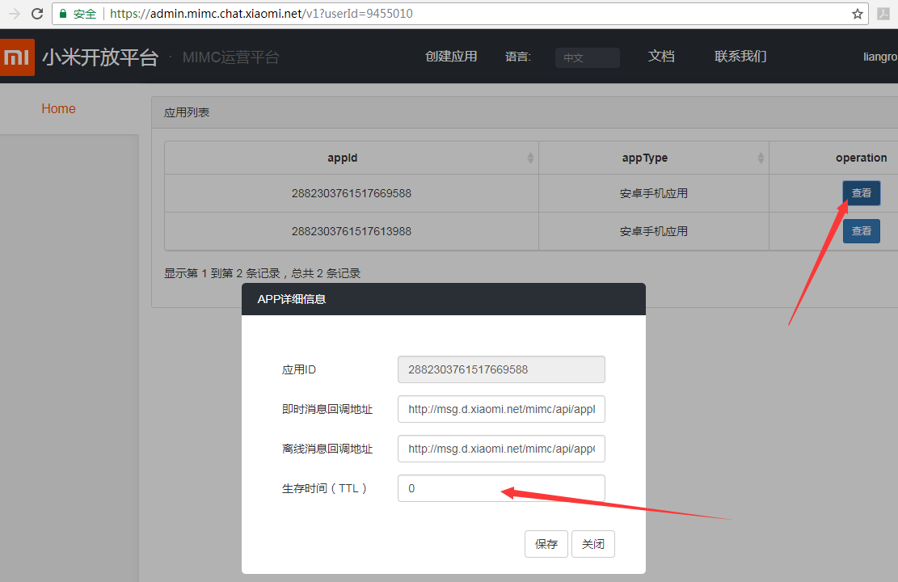

## 临时帐号
#### 应用场景
主要应用于匿名聊天，临时用户，匿名客服等场景。
APP开启临时账号功能后，所申请账号会在一段时间后被删除，且不能创建群组。

#### 如何接入
```
管理平台：https://admin.mimc.chat.xiaomi.net
```

生存时间(TTL) 单位为秒，若设置为0表示用户永久有效不删除
<div align="center"></div>